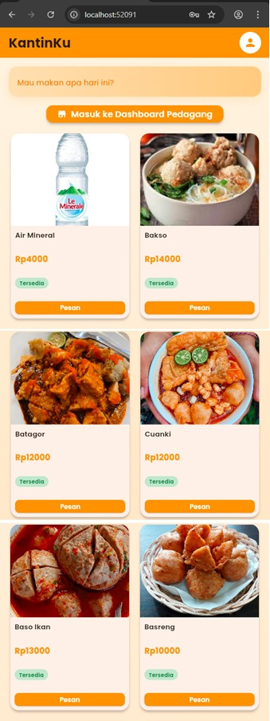
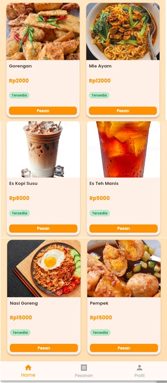

<h1 align="center">KantinKu</h1> 

Aplikasi sederhana berbasis Flutter yang memudahkan mahasiswa untuk memesan makanan dari pedagang sekitar kampus tanpa harus keluar gerbang. Pesanan dapat dilakukan melalui aplikasi dan makanan akan diantar langsung oleh penjual. 

Proyek ini dibuat untuk memenuhi tugas UTS Pemrograman Mobile 2 dengan ketentuan:
- Menggunakan Stateful Widget
- Terdapat Custom Widget (FoodCard)
- Menggunakan GridView sebagai tampilan menu
- Menggunakan Animasi (AnimatedContainer pada tombol "Pesan")
- Menggunakan aset gambar (makanan/minuman)
---

<h2 align="center">Tampilan Aplikasi</h2> 
 

---
<h2 align="center">Dokumentasi Aplikasi</h2> 
 
  <a href="https://drive.google.com/drive/folders/1yN0CBeIpoO-eh4Ej9XvW6phGnG8jXjZS?usp=drive_link"> Video dokumentasi dan File Laporan </a> 

---
<h2 align="center">Dibuat Dengan</h2> 

- Flutter
- Dart
- Visual Studio Code
